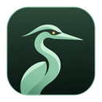
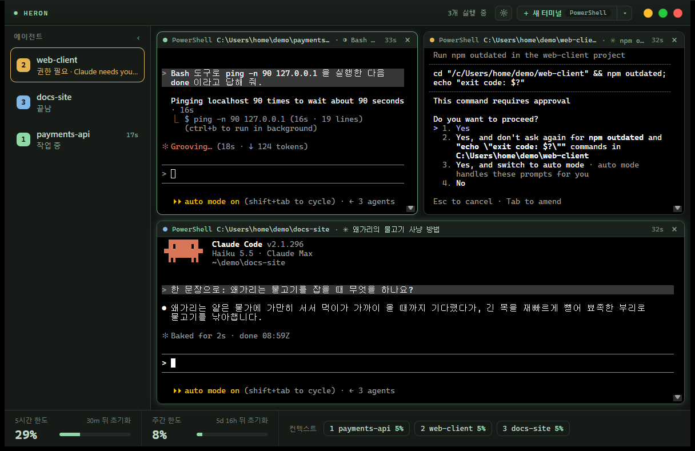
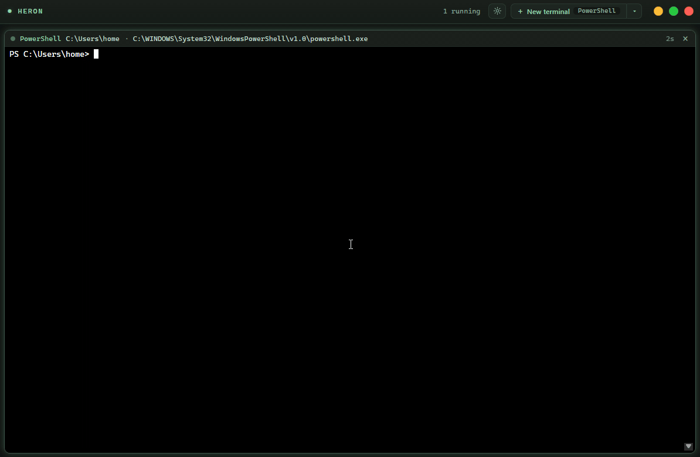
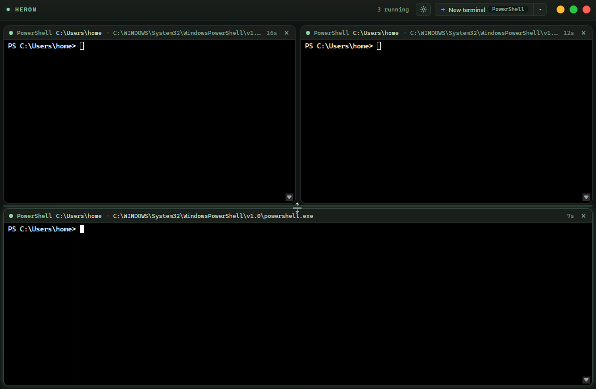
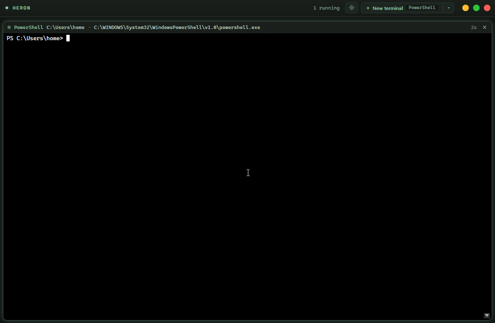
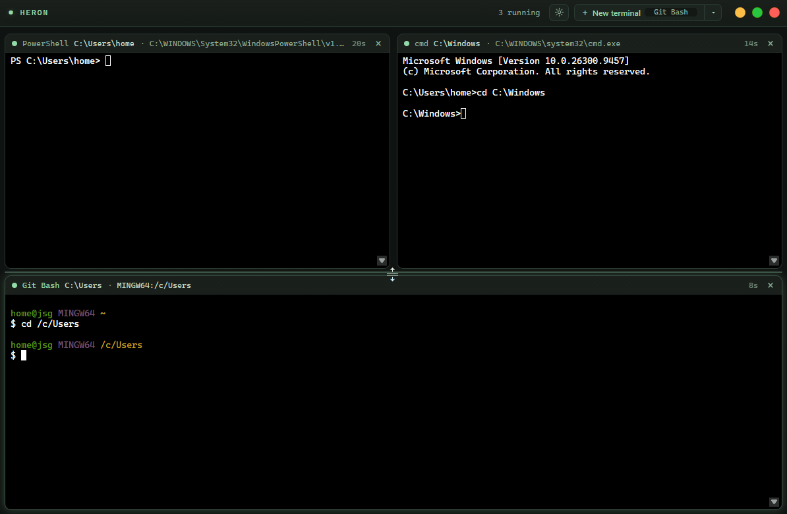
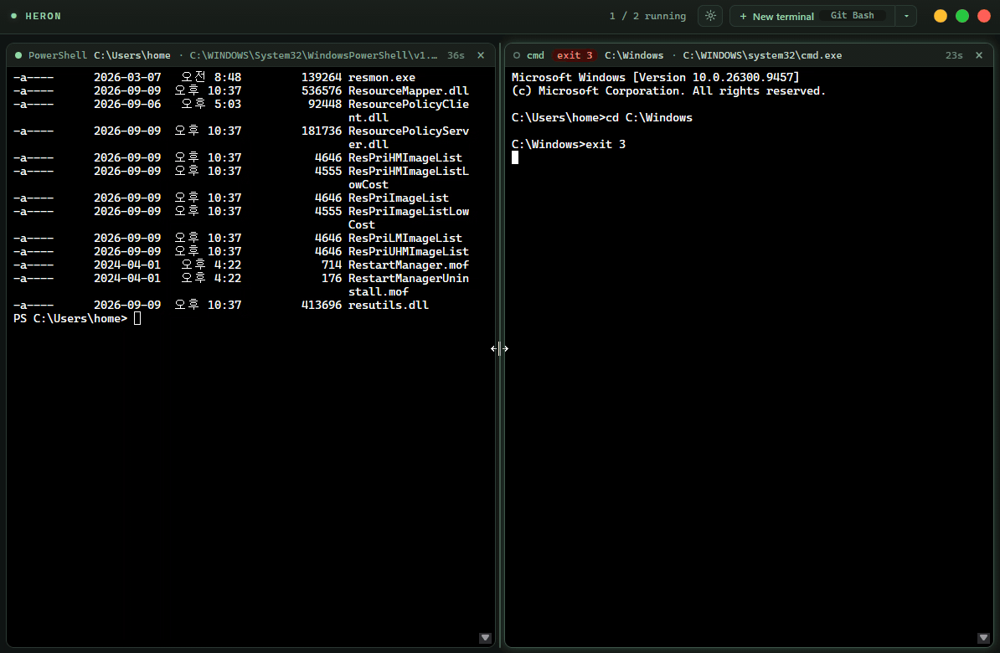

<p align="center">
  
</p>

<h1 align="center">Heron</h1>

<p align="center">
  코딩 에이전트를 나란히 띄우는 가벼운 Windows 터미널. <b>+</b>만 누르면 알아서 화면을 나누고, 사이드바에 Claude Code마다 지금 무엇을 하는지 보여 주고, 나를 기다리는 에이전트가 있으면 작업 표시줄이 깜빡여요.
  <br>
  <a href="README.md">English</a> · <b>한국어</b>
</p>



---

Heron(옛 이름 greenterm)은 한 창에 셸 여러 개를 나란히 띄우고 배치를 자동으로 맞춰 줘요. 외울 분할 단축키는
없고 모든 조작은 버튼과 끌기로 해요. 터미널 안쪽은 건드리지 않아요. 기본 색 그대로, 셸이 출력한
그대로 보여 줘요. 대신 터미널을 감싼 창에 초록(또는 블랙) 테마를 입혀서 어떤 셸이 살아서
일하고 있는지 한눈에 보이게 했어요.

Tauri v2, vanilla TypeScript, xterm.js(WebGL), ConPTY로 만들었어요.

## 기능

### 코딩 에이전트

왼쪽 사이드바에는 에이전트가 있는 pane마다 한 줄씩 생기고,
에이전트 상태 색 배지에 든 pane 번호, 폴더, 에이전트가 하는 일(작업 중이면 경과 시간, 끝남)을 보여 줘요. 나를 기다리는
에이전트가 맨 위에 와요. 줄을 누르면 그 pane으로 가고, 마우스를 올리면 어느 pane인지 테두리로
알려 줘요. pane의 상태 점도 같은 색으로 바뀌어요. Heron이 다른 창 뒤에 있을 때 에이전트가
일을 마치거나 나를 기다리면 작업 표시줄 버튼이 깜빡여요. 사이드바는 배지만 남는 얇은 줄로 접을 수 있어요.
따로 설치할 것은 없어요. Claude Code가 터미널에 붙이는 제목을 읽어서 알아내요.

사이드바 맨 위의 **새 에이전트**를 누르면 선택한 pane의 폴더에 새 pane이 열리고 Claude Code가 시작돼요.
에이전트 아래 **최근 세션**에는 이 PC의 Claude Code 세션이 폴더별로, 아래로 갈수록 최신 순으로 나와요.
폴더를 누르면 접히고 펴져요. 세션을 누르면 그 세션이 마지막으로 돌던 폴더의 새 pane에서 이어서
열리고(`claude --resume`), 오른쪽 클릭하면 휴지통으로 옮길 수 있어요. 지금 Heron이나 다른 터미널에서
실행 중인 세션은 목록에 나오지 않아요.

에이전트가 권한을 기다리거나(무엇을 하려는지까지) 질문하는 것도 보려면 사이드바 아래의 **Turn on**(켜기)을 누르세요.
설정의 **Claude Code 훅** 스위치로 켜도 돼요. Heron이 Claude Code의 `~/.claude/settings.json`에
heron.exe를 부르는 훅 몇 개를 넣어서, 따로 설치할 것은 없어요. Claude Code 2.1.139 이상이
필요해요. 사용자가 넣은 훅은 그대로 두고, 바꾸기 전 파일은 `settings.json.heron-backup`으로
남겨요. 스위치를 끄거나 Heron을 삭제하면 훅도 빠져요. Heron 밖에서는 아무 일도 하지 않아요.

훅을 켜면 Heron이 대화의 답마다 모델도 확인해요. 답한 모델이 선택한 모델(`/model`)과 다르면
그 에이전트 줄에 모델 이름과 함께 경고가 떠요. 답마다 그 답이 왔을 때 선택돼 있던 모델과
한 번만 비교하니까, 모델을 바꿔도 앞선 답이 경고로 바뀌지 않아요. 모델 변경을 훅에 알려 주는
Claude Code 2.1.251 이상이 필요해요. 이어서 연 세션(`claude --continue`, `--resume`)은 훅에 모델을
알려 주지 않아서, 그때는 아래 heron-limits 상태줄이 보여 주는 모델을 써요. 플러그인이 없으면 이어서
연 세션은 모델을 한 번 바꾼 뒤부터 확인해요.

5시간·주간 사용 한도와 에이전트마다 컨텍스트 창을 얼마나 썼는지는 Claude Code의 상태줄로만
들어와요. 이 저장소의 **heron-limits** 플러그인([plugin/](plugin/))이 이 값을 Heron에 넘기고,
Heron은 창 아래 하단바에 보여 줘요. 한도마다 초기화까지 남은 시간, 에이전트마다 컨텍스트
사용량 칩이 나오고, 70%부터 노랑, 90%부터 빨강이에요. 쓰던 상태줄은 그대로 보여요.
Claude Code에서 설치해요.

```
/plugin marketplace add seonggyujo/heron
/plugin install heron-limits@heron
```

Heron은 셸마다 환경변수 두 개(`HERON_PANE`, `HERON_AGENT_DIR`)로 훅과 플러그인에 어느
pane인지 알려 줘요. 훅과 플러그인은 `%LOCALAPPDATA%\io.github.seonggyujo.heron\agents` 아래에 pane마다 작은
파일 몇 개를 남기는데, 이 PC 밖으로 나가지 않고 pane을 닫으면 지워져요. Heron 밖에서는
아무것도 쓰지 않아요.

### 자동 분할

**+ New terminal**을 누르면 배치를 다시 계산해요. 1개면 전체 화면, 2개는 좌우, 3개는 위 2개와
아래 넓은 1개, 4개는 2x2, 5~6개는 3x2예요. 마지막 줄이 비면 남은 pane이 넓어져서 채워요.
pane을 닫으면 나머지가 부드럽게 자리를 옮겨요.



### 끌어서 배치

pane 헤더를 잡고 다른 pane 위에 놓아요. 가장자리 쪽에 놓으면 그쪽으로 나누고(놓일 자리를 미리
보여 줘요), 가운데에 놓으면 두 pane 자리를 바꿔요. Esc를 누르면 취소돼요. pane 사이 틈을 끌면
크기가 바뀌고, 더블클릭하면 반반으로 돌아가요. 직접 배치한 뒤에는 **+**가 선택된 pane의 긴
쪽을 반으로 나눠 새 pane을 넣고, 타이틀바에 격자 버튼이 생겨요. 누르면 자동 분할로 돌아가요.



### 셸 선택, 폴더, 실행 시간

▾ 메뉴에는 이 PC에 설치된 셸(PowerShell 7, Windows PowerShell, cmd, Git Bash)만 나오고,
여기서 고른 셸을 **+** 버튼이 열어요. pane 헤더에는 셸 이름, 현재 폴더, 실행 중인 프로그램이
정한 제목, 실행 시간이 보여요.



### 살아 있는 표시

출력이 들어오면 pane 테두리가 반짝이고 상태 점이 몇 초간 깜빡여서 바쁜 터미널이 눈에 띄어요.
`exit`하면 Windows Terminal처럼 pane이 닫히고(설정에서 끌 수 있어요), 오류 코드로 끝나면
pane을 남긴 채 붉은 exit 뱃지를 보여 줘요.



### 설정

타이틀바의 톱니 버튼을 누르면 설정 창이 열려요. 창 테마(초록, 블랙), 언어(English, 한국어.
처음에는 Windows 표시 언어를 따라가요), 터미널 글씨 크기, 애니메이션 켜고 끄기, 정상 `exit` 때
pane 닫기, Claude Code 훅을 바꿀 수 있어요. 바꾸면 바로 적용되고 다음
실행에도 기억해요. 아래 **Reset**은 한 번 더 물어본 뒤에 모든 설정을 기본값으로 되돌려요.



### 그 밖에

- 탐색기에서 폴더나 드라이브를 우클릭하면 **Open in Heron**이 있어요(Windows 11은 "추가 옵션 표시" 안). Heron이 이미 켜져 있으면 그 창에 새 pane으로 열려요.
- 출력에 나온 링크는 Ctrl+클릭하면 기본 브라우저로 열려요(http, https만).
- 파일을 pane에 끌어다 놓으면 Windows Terminal처럼 경로가 입력돼요. CLI 도구에 이미지를 첨부할 때 편해요.
- 우클릭: 선택한 글자가 있으면 복사, 없으면 붙여넣기(Windows 콘솔과 같음). Ctrl+C는 선택이
  있으면 복사, 없으면 중단. Ctrl+V는 붙여넣기.
- 터미널에서는 브라우저 단축키(F5, Ctrl+R, Ctrl+F 등)가 WebView에서 동작하지 않고 셸로 가요.
- macOS 스타일 타이틀바와 신호등 버튼(Windows 순서).
- 한글 IME 입력이 되고, 출력을 바이트 그대로 다뤄서 한글이 중간에 잘려 깨지지 않아요.

## 성능

Windows 11, 논리 코어 12개, release 빌드에서 측정했어요. 자세한 내용은
[docs/PERFORMANCE.md](docs/PERFORMANCE.md)에 있어요.

| | pane 1개 | pane 6개 |
| --- | --- | --- |
| 대기 CPU | 0.01% | 0.03% |
| 앱 메모리(앱 + WebView2) | 69.7 MB | 87.5 MB |

pane 6개에서 `Get-ChildItem -Recurse C:\Windows`를 동시에 돌려도 앱 메모리는 최고 99 MB에서
다시 내려왔고, 50ms를 넘는 long task는 한 번도 없었어요.

## 필요한 것

- WebView2 런타임이 있는 Windows 10 또는 11(Windows 11에는 기본 설치)
- 빌드하려면: [Node.js](https://nodejs.org/) 20 이상, [Rust](https://rustup.rs/) stable,
  [Tauri Windows 사전 준비](https://tauri.app/start/prerequisites/)

## 빌드와 실행

```powershell
npm install
npm run tauri:dev                    # 개발 실행, 로그가 터미널에 나옴
npm run tauri build -- --no-bundle   # release exe: src-tauri\target\release\heron.exe
npm run tauri build                  # release exe와 설치 프로그램
```

개발 실행 중에는 Rust와 프론트 로그가 `tauri:dev` 터미널에 함께 나와요. 로그 레벨은
`HERON_LOG` 환경변수(`error`, `warn`, `info`, `debug`(기본), `trace`)로 바꿔요.

## 구조

파일 하나는 기능 하나만 맡고 약 150줄 안쪽으로 유지해요. 모듈별 지도는
[docs/ARCHITECTURE.md](docs/ARCHITECTURE.md)에 있어요.
README의 GIF는 [scripts/demo](scripts/demo/README.md)의 스크립트로 녹화해요.

## 라이선스

[MIT](LICENSE)
