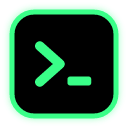
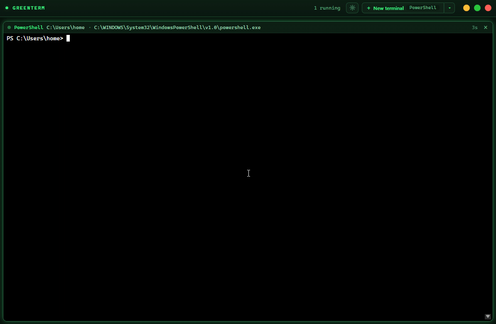
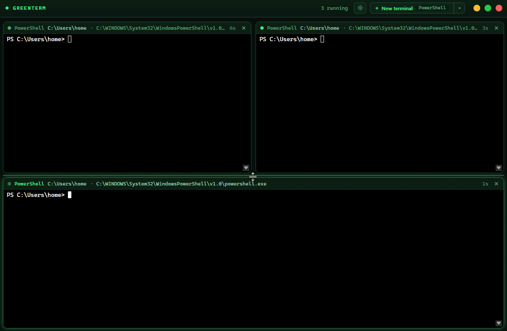
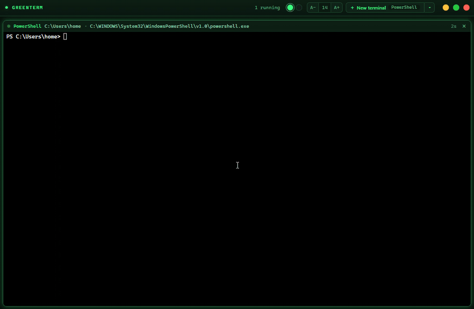
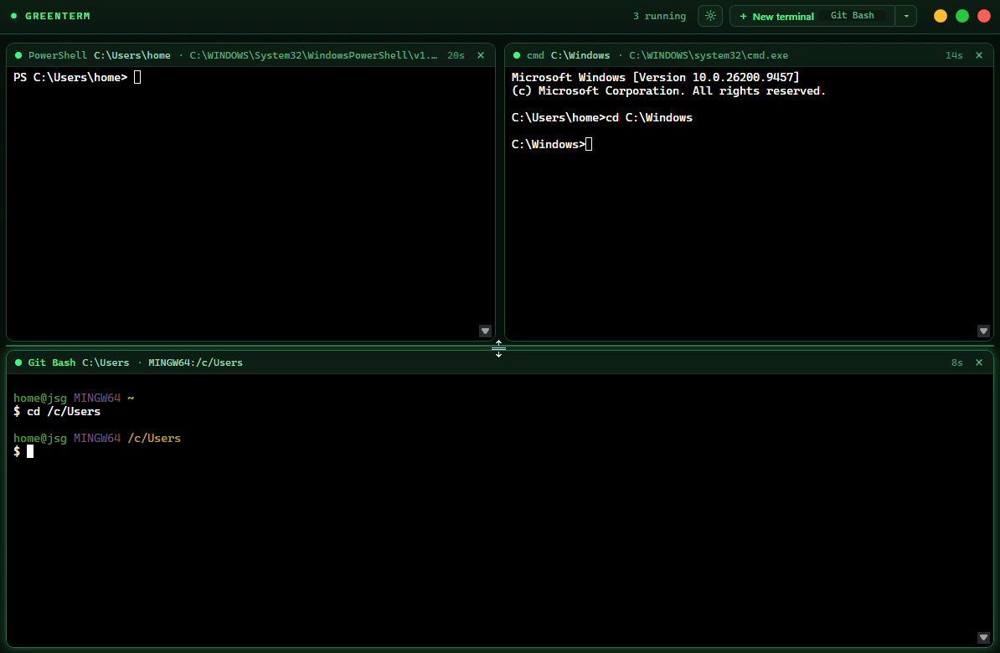
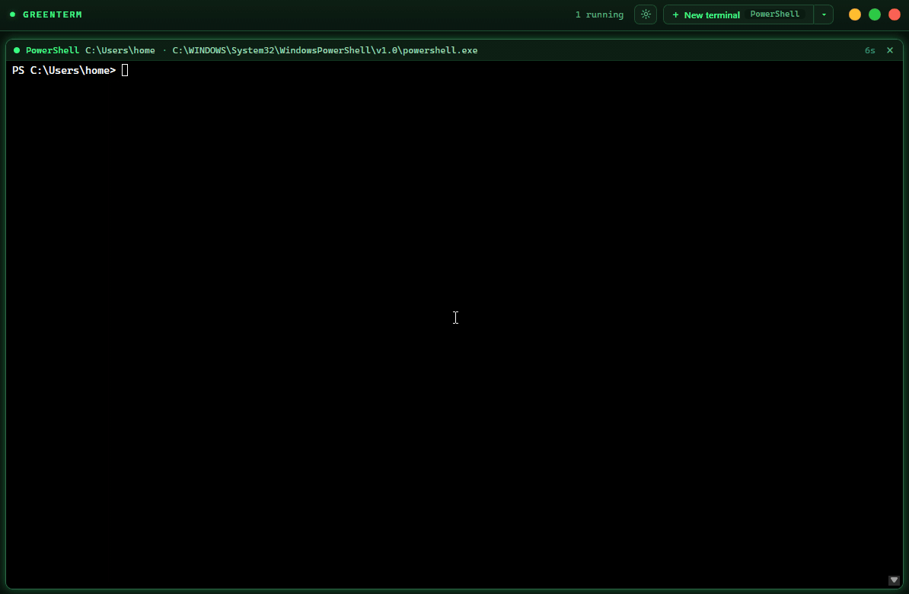
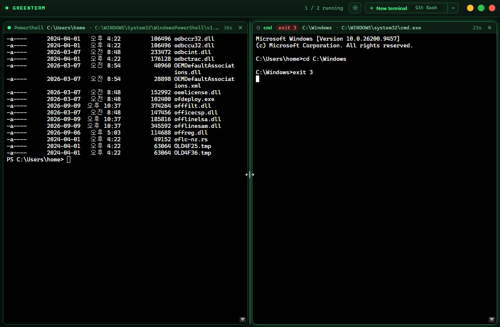

<p align="center">
  
</p>

<h1 align="center">greenterm</h1>

<p align="center">
  A lightweight Windows terminal app that splits itself: press <b>+</b> and the panes rearrange automatically.
  <br>
  <b>English</b> · <a href="README.ko.md">한국어</a>
</p>

---

greenterm opens several shells side by side in one window and lays them out for you. There are no
split shortcuts to learn: every action is a button or a drag. The terminals themselves are left untouched
(default colors, your shell's own output), while the window around them has a green (or black)
theme that shows which shells are alive.

Built with Tauri v2, vanilla TypeScript, xterm.js (WebGL) and ConPTY.

## Features

### Automatic grid

Press **+ New terminal** and the grid recomputes: 1 pane fills the window, 2 sit side by side,
3 become two on top and one wide below, 4 is 2x2, 5 and 6 are 3x2. A short last row stretches to
fill the width. Closing a pane lets the others glide into place.



### Arrange by dragging

Grab a pane by its header and drop it on another pane. Near an edge it splits that pane on that
side (a preview shows where it will land); in the middle the two panes swap places. Esc cancels.
Drag the gap between two panes to resize them, and double-click it to make them equal again.
Once you arrange panes yourself, **+** splits the focused pane along its longer side, and a grid
button appears in the title bar that brings back the automatic grid.



### Shells, folder and uptime

The ▾ menu lists the shells installed on the machine (PowerShell 7, Windows PowerShell, cmd,
Git Bash) and selects the one the **+** button opens. Each pane header shows the shell, its
current folder, the title set by the running program, and how long it has been running.



### Alive at a glance

Output makes the pane border flash and the status dot pulse for a few seconds, so busy terminals
stand out. `exit` closes the pane like Windows Terminal does (this can be turned off in the
settings); a failing exit keeps the pane open with a red exit-code badge.



### Web pages

Pick **Web page** at the bottom of the ▾ menu to open a web page as a pane, YouTube by default.
The pane header has back, reload and an address box that also takes search words, and web panes
split, move and resize by dragging like terminals. Links that want a new window open in your
default browser.

Web panes run on WebView2 with a profile of their own, separate from your browser and from
greenterm's settings. Google blocks signing in from embedded browsers, so YouTube works without an
account. While a menu, the settings or a pane
drag is on screen, web panes step aside and come back when it closes.



### Settings

The gear button in the title bar opens the settings: green or black window theme, terminal font
size, animations on or off, whether a clean `exit` closes the pane, and the web start page.
Every change applies at once and is remembered. Two buttons below them ask once more before they
act: **Clear** deletes the cookies, history and site data of web panes, and **Reset** puts every
setting back to its default.



### Also

- **Open in greenterm** in the Explorer context menu of folders and drives (on Windows 11 under "Show more options"). If greenterm is already running, the folder opens as a new pane.
- Ctrl+click a link in the output to open it in your browser (http and https only).
- Drop files on a pane to type their paths, like Windows Terminal (handy for attaching images in CLI tools).
- Right-click copies the selection, or pastes when nothing is selected (like the Windows console).
  Ctrl+C copies a selection, otherwise it interrupts. Ctrl+V pastes.
- In terminals, browser shortcuts (F5, Ctrl+R, Ctrl+F, ...) never reach the web view, so they go to the shell.
- macOS-style title bar with traffic-light buttons in Windows order.
- Korean and other IME input works; output is handled as raw bytes, so multi-byte text is never cut.

## Performance

Measured on Windows 11, 12 logical cores, release build. Details in
[docs/PERFORMANCE.md](docs/PERFORMANCE.md).

| | 1 pane | 6 panes |
| --- | --- | --- |
| Idle CPU | 0.01 % | 0.03 % |
| App memory (app + WebView2) | 69.7 MB | 87.5 MB |

With six panes printing `Get-ChildItem -Recurse C:\Windows` at once, app memory peaked at 99 MB
and went back down afterwards, and no long task (> 50 ms) was recorded.

## Requirements

- Windows 10 or 11 with the WebView2 runtime (preinstalled on Windows 11)
- To build: [Node.js](https://nodejs.org/) 20+, [Rust](https://rustup.rs/) stable, and the
  [Tauri prerequisites for Windows](https://tauri.app/start/prerequisites/)

## Build and run

```powershell
npm install
npm run tauri:dev                    # development, with logs in the terminal
npm run tauri build -- --no-bundle   # release exe: src-tauri\target\release\greenterm.exe
npm run tauri build                  # release exe plus installers
```

Development logs from both Rust and the frontend appear in the `tauri:dev` terminal. Set
`GREENTERM_LOG` to `error`, `warn`, `info`, `debug` (default) or `trace` to change the level.

## Project layout

Each file does one thing and stays around 150 lines. See
[docs/ARCHITECTURE.md](docs/ARCHITECTURE.md) for the map of every module.
The README GIFs are recorded by scripts in [scripts/demo](scripts/demo/README.md).

## License

[MIT](LICENSE)
