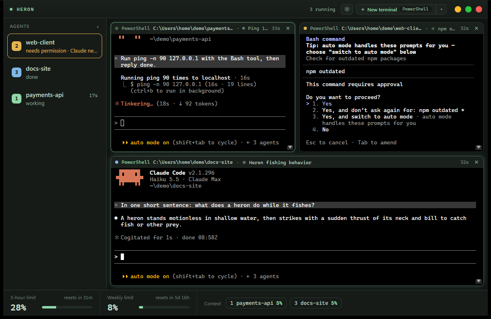

<p align="center">
  
</p>

<h1 align="center">Heron</h1>

<p align="center">
  A lightweight Windows terminal for running coding agents side by side. Press <b>+</b> and the panes arrange themselves; a sidebar shows what each Claude Code is doing, and the taskbar flashes when one needs you.
  <br>
  <b>English</b> · <a href="README.ko.md">한국어</a>
</p>



---

Heron (formerly greenterm) opens several shells side by side in one window and lays them out for you. There are no
split shortcuts to learn: every action is a button or a drag. The terminals themselves are left untouched
(default colors, your shell's own output), while the window around them has a green (or black)
theme that shows which shells are alive.

Built with Tauri v2, vanilla TypeScript, xterm.js (WebGL) and ConPTY.

## Features

### Coding agents

The sidebar on the left has a row for each pane that runs a coding agent: the pane number in a badge of the agent's color, its folder and what the agent is doing
(working, with a timer, or done). When the folder is a git repository, the row also counts the
lines not committed yet (`+12 −3`). Agents that need you come first. Click a row to jump to that pane, or point at it to see which pane
it is; the pane's status dot takes the same color. While Heron is behind another window, its
taskbar button flashes when an agent finishes or needs you. The sidebar folds into a narrow rail of
badges. This needs nothing else: Heron reads the title Claude Code gives the terminal, and asks git.

**New agent** at the top of the sidebar opens a pane in the selected pane's folder and starts Claude
Code there. Its **▾** lists the folders of your recent sessions and **Choose a folder…**. Next to a git
repository, **worktree** starts the agent in a new git worktree (`claude --worktree`): a folder and a
branch of its own, so two agents in one repository do not edit each other's files. Claude Code
makes worktrees only in a folder you have trusted, which it asks the first time you run it there.
Below the agents, **Recent sessions** lists the Claude Code sessions of this PC by folder, newest
at the bottom; click a folder to fold it. Click a session to pick it up again (`claude --resume`)
in a new pane, in the folder it last ran in, or right-click it to move it to the Recycle Bin.
Sessions that run right now, in Heron or in another terminal, are left out.

To also see when an agent needs your permission (and for what) or asks a question, press **Turn on**
at the bottom of the sidebar (or switch on **Claude Code hooks** in the settings). Heron then adds a few hooks
to Claude Code's `~/.claude/settings.json` that run heron.exe itself, so there is nothing else to
install. This needs Claude Code 2.1.139 or later. Your own hooks stay as they are, and the previous
file is kept as `settings.json.heron-backup`. Switching it off, or uninstalling Heron, takes
the hooks out again; outside Heron they do nothing. With the hooks on, each row also shows the
model the session runs (it follows `/model` within a second) and, under it, the subagents running
now with how long each has run.

With the hooks on, Heron also checks every answer of the conversation: when the model that wrote
it is not the one you selected (`/model`), the agent's row warns with the model's name. Each
answer is checked once, against the model selected when it arrived, so switching models does not
turn earlier answers into warnings. This needs Claude Code 2.1.251 or later, which tells hooks
about model switches. A session you resume (`claude --continue`, `--resume`) does not tell hooks
its model, so there Heron uses the model the heron-limits status line (below) shows; without the
plugin, a resumed session is checked only after you switch models.

Your 5-hour and weekly usage limits, and how full each agent's context window is, reach only
Claude Code's status line. The **heron-limits** plugin in this repository ([plugin/](plugin/))
passes them to Heron, which shows them in a bar along the bottom of the window: each limit with
the time until it resets, and a chip per agent with its context use (yellow from 70%, red from
90%). Your status line shows the same as before. In Claude Code:

```
/plugin marketplace add seonggyujo/heron
/plugin install heron-limits@heron
```

Two environment variables in each shell (`HERON_PANE`, `HERON_AGENT_DIR`) tell the hooks
and the plugin which pane they run in. They write a few small files per pane under
`%LOCALAPPDATA%\io.github.seonggyujo.heron\agents`; the files stay on your machine and are deleted when the
pane closes. Outside Heron nothing is written.

### Reopen last work

When Heron starts, it opens the panes of the last run again: the same shells in the same folders,
in your own arrangement if you made one. A pane that ran Claude Code resumes its session
(`claude --resume`); a session that never got a message, or runs in another terminal by then,
starts afresh instead. Resuming needs the hooks above, which tell Heron each pane's session.
Turn it off in the settings (**Reopen last work**).

### Automatic grid

Press **+ New terminal** and the grid recomputes: 1 pane fills the window, 2 sit side by side,
3 become two on top and one wide below, 4 is 2x2, 5 and 6 are 3x2. A short last row stretches to
fill the width. Closing a pane lets the others glide into place.


### Arrange by dragging

Grab a pane by its header and drop it on another pane. Near an edge it splits that pane on that
side (a preview shows where it will land); in the middle the two panes swap places. Esc cancels.
Drag the gap between two panes to resize them, and double-click it to make them equal again.
Once you arrange panes yourself, **+** splits the focused pane along its longer side, and a grid
button appears in the title bar that brings back the automatic grid.


### Shells, folder and uptime

The ▾ menu lists the shells installed on the machine (PowerShell 7, Windows PowerShell, cmd,
Git Bash) and selects the one the **+** button opens. Each pane header shows the shell, its
current folder, the title set by the running program, and how long it has been running.


### Alive at a glance

Output makes the pane border flash and the status dot pulse for a few seconds, so busy terminals
stand out. `exit` closes the pane like Windows Terminal does (this can be turned off in the
settings); a failing exit keeps the pane open with a red exit-code badge.


### Settings

The gear button in the title bar opens the settings: green or black window theme, language
(English or Korean; it starts in the Windows display language), terminal font size, animations on
or off, whether a clean `exit` closes the pane, and Claude Code hooks. Every change applies at once and is remembered. **Reset** below them asks once more before it puts every setting back to
its default.


### Also

- **Open in Heron** in the Explorer context menu of folders and drives (on Windows 11 under "Show more options"). If Heron is already running, the folder opens as a new pane.
- Ctrl+click a link in the output to open it in your browser (http and https only).
  In apps that track the mouse (Claude Code, vim), that click is not passed to the app, so the link opens once.
- Drop files on a pane to type their paths, like Windows Terminal (handy for attaching images in CLI tools).
- Right-click copies the selection, or pastes when nothing is selected (like the Windows console).
  When an app tracks the mouse (vim, Claude Code), the right-click goes to the app instead,
  like Windows Terminal. Shift+right-click still copies or pastes.
  Ctrl+C copies a selection, otherwise it interrupts. Ctrl+V pastes.
- In terminals, browser shortcuts (F5, Ctrl+R, Ctrl+F, ...) never reach the web view, so they go to the shell.
- macOS-style title bar with traffic-light buttons in Windows order.
- Korean and other IME input works; output is handled as raw bytes, so multi-byte text is never cut.

## Performance

Measured on Windows 11, 12 logical cores, release build. Details in
[docs/PERFORMANCE.md](docs/PERFORMANCE.md).

| | 1 pane | 6 panes |
| --- | --- | --- |
| Idle CPU | 0.01 % | 0.03 % |
| App memory (app + WebView2) | 69.7 MB | 87.5 MB |

With six panes printing `Get-ChildItem -Recurse C:\Windows` at once, app memory peaked at 99 MB
and went back down afterwards, and no long task (> 50 ms) was recorded.

## Requirements

- Windows 10 or 11 with the WebView2 runtime (preinstalled on Windows 11)
- To build: [Node.js](https://nodejs.org/) 20+, [Rust](https://rustup.rs/) stable, and the
  [Tauri prerequisites for Windows](https://tauri.app/start/prerequisites/)

## Build and run

```powershell
npm install
npm run tauri:dev                    # development, with logs in the terminal
npm run tauri build -- --no-bundle   # release exe: src-tauri\target\release\heron.exe
npm run tauri build                  # release exe plus installers
```

Development logs from both Rust and the frontend appear in the `tauri:dev` terminal. Set
`HERON_LOG` to `error`, `warn`, `info`, `debug` (default) or `trace` to change the level.

## Project layout

Each file does one thing and stays around 150 lines. See
[docs/ARCHITECTURE.md](docs/ARCHITECTURE.md) for the map of every module.
The README GIFs are recorded by scripts in [scripts/demo](scripts/demo/README.md).

## License

[MIT](LICENSE)
